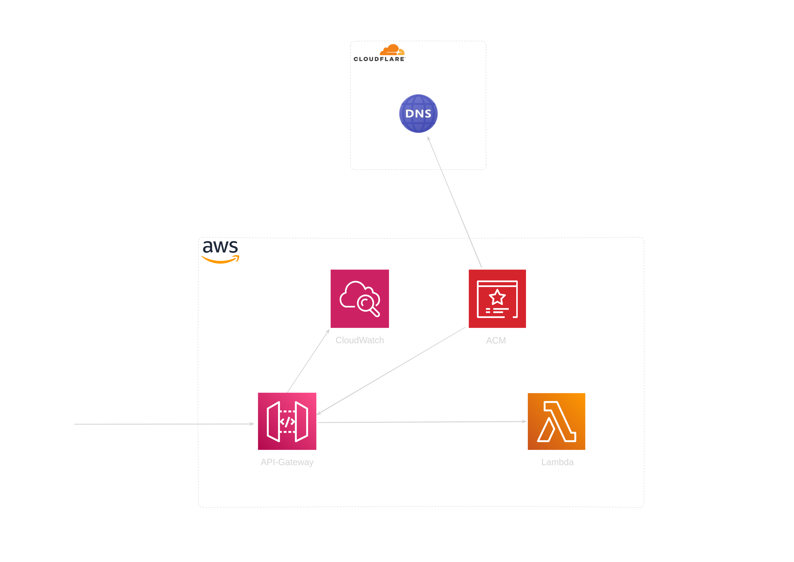

# Static web on lambda with Terraform

Module sets up an AWS Lambda function and an API Gateway, secured with an ACM certificate and configured with custom domain names via Cloudflare.

## Table of Contents

1. [Inputs](#inputs)
2. [Usage](#usage)
3. [Lambda Function Requirements](#lambda-function-requirements)
    - [main.go](#main)
    - [routes.go](#routes)
    - [server.go](#server)
    - [Makefile](#makefile)
4. [Modules](#modules)
    - [ACM Module](#acm-module)
    - [Lambda Web Module](#lambda-web-module)
    - [API Gateway Module](#api-gateway-module)
    - [Lambda IAM Role Module](#lambda-iam-role-module)
5. [Resources](#resources)
    - [AWS ACM Certificate Validation](#aws-acm-certificate-validation)
    - [AWS API Gateway v2 Domain Name](#aws-api-gateway-v2-domain-name)
    - [AWS API Gateway v2 API Mapping](#aws-api-gateway-v2-api-mapping)
    - [Cloudflare Records](#cloudflare-records)
6. [Testing](#testing)



## Inputs

- `domain`: Domain name for the API Gateway custom domain.
- `environment`: Environment (e.g., dev, prod) for the ACM certificate.
- `go_bin_dir`: Directory containing the Go binaries.
- `lambda_func_name`: name of the Lambda function.
- `cloudflare_zone_id`: Cloudflare zone ID.
- `cloudflare_api_token`: Cloudflare API token.

## Usage

1. Define the required input variables: `domain`, `environment`, `go_bin_dir`, `lambda_func_name`, `cloudflare_zone_id` and `cloudflare_api_token` in.
2. Include the module in your Terraform configuration and provide the necessary inputs.
3. Apply the Terraform configuration to provision the resources.

```hcl
terraform {
  required_providers {
    aws = {
      source  = "hashicorp/aws"
      version = "~> 5.0"
    }
    cloudflare = {
      source  = "cloudflare/cloudflare"
      version = "~> 4.0"
    }
  }
  required_version = ">= 1.0.0, < 2.0.0"
}
provider "aws" {
  region = "us-east-1"
}

provider "cloudflare" {
  api_token = "your_cloudflare_api_token"
}

module "module_name" {
  source = "github.com/ujstor/aws-lambda-static-website//modules/modules/services/lambda-web-domain?ref=v0.0.1"

  domain              = "your.domain.com"
  environment         = "prod"
  go_bin_dir          = "/path/to/go/bin"
  lambda_func_name    = "lambda_function"
  cloudflare_zone_id  = "your_cloudflare_zone_id"
}
```
## Lambda Function Requirements

This module expects the provided Go binary to be configured specifically to work with AWS Lambda. 
The Go binary should include all necessary dependencies and configurations.
The best way is to use a templ with embedded FS that is compiled into the binary.
Below is an example of Go code necessary to work with AWS Lambda.
You can also check implem in the [examples](./modules/examples/go-lambda-code/complete-website/) directory.

### main

```go
package main

import (
	"context"
	"github.com/aws/aws-lambda-go/events"
	"github.com/aws/aws-lambda-go/lambda"
	"github.com/aws/aws-lambda-go/lambdacontext"
	"log"
	"portfolio-web/internal/server"
)

func handler(ctx context.Context, req events.APIGatewayProxyRequest) (events.APIGatewayProxyResponse, error) {
	lc, ok := lambdacontext.FromContext(ctx)
	if !ok {
		log.Println("Failed to get Lambda context")
		return events.APIGatewayProxyResponse{StatusCode: 500, Body: "Internal Server Error"}, nil
	}
	log.Printf("request received from AWS Lambda, request ID: %s", lc.AwsRequestID)

	srv := server.NewServer()
	resp, err := srv.HandleRequest(ctx, req)
	if (err != nil) {
		log.Printf("Error handling request: %v", err)
		return events.APIGatewayProxyResponse{StatusCode: 500, Body: "Internal Server Error"}, nil
	}
	return resp, nil
}

func main() {
	lambda.Start(handler)
}
```

### routes

```go
package server

import (
	"context"
	"github.com/a-h/templ"
	"github.com/aws/aws-lambda-go/events"
	chiadapter "github.com/awslabs/aws-lambda-go-api-proxy/chi"
	"github.com/go-chi/chi/v5"
	"github.com/go-chi/chi/v5/middleware"
	"net/http"
	"portfolio-web/cmd/web"
)

func (s *Server) RegisterRoutes() *chi.Mux {
	r := chi.NewRouter()
	r.Use(middleware.Logger)

	fileServer := http.FileServer(http.FS(web.Files))
	r.Handle("/assets/*", fileServer)
	r.Get("/", templ.Handler(web.Portfolio()).ServeHTTP)

	return r
}

func (s *Server) HandleRequest(ctx context.Context, req events.APIGatewayProxyRequest) (events.APIGatewayProxyResponse, error) {
	chiLambda := chiadapter.New(s.RegisterRoutes())
	return chiLambda.ProxyWithContext(ctx, req)
}
```

### server

```go
package server

type Server struct{}

func NewServer() *Server {
	return &Server{}
}
``````
### Makefile

```make
all: build

build:
	@echo "Building..."
	@if command -v templ > /dev/null; then \
			templ generate; \
	else \
		read -p "Go's 'templ' is not installed on your machine. Do you want to install it? [Y/n] " choice; \
		if [ "$$choice" != "n" ] && [ "$$choice" != "N" ]; then \
			go install github.com/a-h/templ/cmd/templ@latest; \
			templ generate; \
		else \
			echo "You chose not to install templ. Exiting..."; \
			exit 1; \
		fi; \
	fi
	@GOOS=linux GOARCH=amd64 go build -o bootstrap cmd/api/main.go

clean:
	@echo "Cleaning..."
	@rm -f bootstrap

.PHONY: all build clean
```

## Modules

### ACM Module

The ACM module provisions an ACM certificate for the given domain.

```hcl
module "acm" {
  source = "../../ACM-cert-manager/"

  domain      = var.domain
  environment = var.environment
}
```

### Lambda Web Module

The Lambda Web module sets up a Lambda function with the specified configuration.

```hcl
module "lambda_web" {
  source = "../../lambda/"

  lambda_config = {
    work_dir          = var.go_bin_dir
    bin_name          = "bootstrap"
    archive_bin_name  = "function.zip"
    handler           = "main"
    runtime           = "provided.al2023"
    ephemeral_storage = "512"
    archive_type      = "zip"
  }

  function_name   = var.lambda_func_name
  lambda_iam_role = module.lambda_iam_role.lambda_iam_role__arn
}
```

### API Gateway Module

The API Gateway module configures an API Gateway with Lambda integration and authorizer settings.

```hcl
module "api_gateway" {
  source = "../../api-gateway-lambda"

  lambda_integration_route_premission = {
    integration_type                  = "AWS_PROXY"
    integration_method                = "POST"
    connection_type                   = "INTERNET"
    route_key                         = "GET /{proxy+}"
    statement_id                      = "AllowExecutionFromAPIGateway"
    action                            = "lambda:InvokeFunction"
    principal                         = "apigateway.amazonaws.com"
    authorizer_type                   = "REQUEST"
    indentity_sources                 = ["$request.header.Authorization"]
    authorizer_name                   = "example-authorizer"
    authorizer_payload_format_version = "1.0"
  }

  lambda_func_name  = module.lambda_web.lambda_arn.lambda_name
  lambda_invoke_arn = module.lambda_web.lambda_arn.lambda_arn
  authorizer_uri    = module.lambda_web.lambda_arn.invoke_arn

  api_gw_conf = {
    name          = var.lambda_func_name
    protocol_type = "HTTP"
  }
}
```

### Lambda IAM Role Module

The Lambda IAM Role module provisions an IAM role for the Lambda function.

```hcl
module "lambda_iam_role" {
  source = "../../roles/lambda-role/"

  iam_lambda_role_name = var.lambda_func_name
}
```

## Resources

### AWS ACM Certificate Validation

Validates the ACM certificate by creating the necessary DNS records.

```hcl
resource "aws_acm_certificate_validation" "cert_validation" {
  certificate_arn         = module.acm.certificate_arn
  validation_record_fqdns = [for dvo in module.acm.CNAME_records : dvo.name]
}
```

### AWS API Gateway v2 Domain Name

Configures a custom domain name for the API Gateway.

```hcl
resource "aws_apigatewayv2_domain_name" "lambda_domain" {
  domain_name = var.domain

  domain_name_configuration {
    certificate_arn = aws_acm_certificate_validation.cert_validation.certificate_arn
    endpoint_type   = "REGIONAL"
    security_policy = "TLS_1_2"
  }
}
```

### AWS API Gateway v2 API Mapping

Maps the API Gateway to the custom domain name.

```hcl
resource "aws_apigatewayv2_api_mapping" "example" {
  api_id      = module.api_gateway.apigateway2_api_id
  domain_name = aws_apigatewayv2_domain_name.lambda_domain.id
  stage       = module.api_gateway.apigateway2_stage_id
}
```

### Cloudflare Records

Creates DNS records in Cloudflare for the API Gateway custom domain.

```hcl
resource "cloudflare_record" "api_gw_domain" {
  zone_id = var.cloudflare_zone_id
  name    = module.acm.CNAME_records[0].name
  value   = module.acm.CNAME_records[0].value
  type    = "CNAME"
  ttl     = 3600
  proxied = false
}

resource "cloudflare_record" "api_gw_domain_attach" {
  zone_id = var.cloudflare_zone_id
  name    = local.domain_prefix
  value   = aws_apigatewayv2_domain_name.lambda_domain.domain_name_configuration[0].target_domain_name
  type    = "CNAME"
  ttl     = 3600
  proxied = false
}
```

## Testing

Module unit test with [Terratest](https://github.com/gruntwork-io/terratest) and go:

```bash
go test -v -timeout 30m -run TestLambdaExample
go test -v -timeout 30m -run TestLambdaWebExample
go test -v -timeout 30m -run TestLambdaApiExample
go test -v -timeout 30m -run TestLambdaWebDomainExample
```
Test /register /login api:
```bash
curl -X POST https://kz05q9n2p2.execute-api.us-east-1.amazonaws.com/register \
     -H "Content-Type: application/json" \
     -d '{"username": "testuser", "password": "testpass"}'
```
